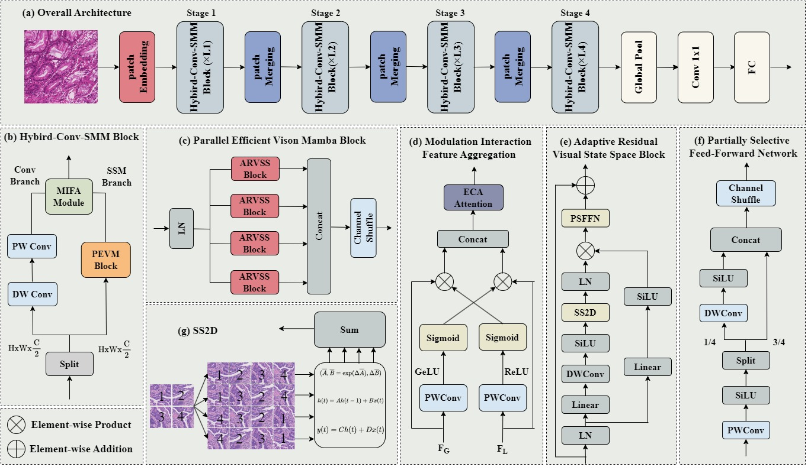

<div align="center">

<h3>Microscopic-Mamba: Revealing the Secrets of Microscopic Images with Only 4M Parameters</h3>

[[`Paper`]()] 
[[`Project Page`]()]


</div>

## Abstract
In the field of medical microscopic image classification
(MIC), CNN-based and Transformer-based models have been
extensively studied. However, CNNs struggle with modeling
long-range dependencies, limiting their ability to fully utilize
semantic information in images. Conversely, Transformers
are hampered by the complexity of quadratic computations.
To address these challenges, we propose a model based on
the Mamba architecture: Microscopic-Mamba. Specifically,
we designed the Partially Selected Feed Forward Network
(PSFFN) to replace the last linear layer of the Visual State
Space Module (VSSM), enhancing Mamba’s local feature
extraction capabilities. Additionally, we introduced the Mod-
ulation Interaction Feature Aggregation (MIFA) module to
effectively modulate and dynamically aggregate global and
local features. We also incorporated a parallel VSSM mech-
anism to improve inter-channel information interaction while
reducing the number of parameters. Extensive experiments
have demonstrated that our method achieves state-of-the-art
performance on five public datasets.

## Overview
<p align="center">
  
</p>

---

## 💎Let's Get Started!
### `A. Installation`

Note that the code in this repo runs under **Linux** system. 

The repo is based on the [VMama repo](https://github.com/MzeroMiko/VMamba), thus you need to install it first. The following installation sequence is taken from the VMamba repo. 

**Step 1: Clone the repository:**

Clone this repository and navigate to the project directory:
```bash
git clone https://github.com/zs1314/Microscopic-Mamba.git
cd Microscopic-Mamba
```


**Step 2: Environment Setup:**

It is recommended to set up a conda environment and installing dependencies via pip. Use the following commands to set up your environment:

***Create and activate a new conda environment***

```bash
conda create -n msmamba
conda activate msmamba
```

***Install dependencies***

```bash
pip install -r requirements.txt
cd kernels/selective_scan && pip install .
```

### `B. Data Preparation`

The five datasets [RPE](https://www.ncbi.nlm.nih.gov/pmc/articles/PMC4760937/), [MHIST](https://bmirds.github.io/MHIST/) , [SARS](https://lhncbc.nlm.nih.gov/LHC-downloads/downloads.html#malaria-datasets) ,[TissueMnist](https://medmnist.com/) and [MedMf_colon](https://medfm2023.grand-challenge.org/medfm2023/) are used for MIC experiments. Please download them and make them have the following folder/file structure:
```
${DATASET_ROOT}   # Dataset root directory, for example: /home/username/data
├── RPE
    ├── train
    │   ├── class 1
    │   │   ├──00001.png
    │   │   ├──00002.png
    │   │   ├──00003.png
    │   │   ...
    │   │
    │   ├── class 2
    │   │   ├──00001.png
    │   │   ... 
    │   │
    │   └── class n
    │       ├──00001.png 
    │       ...   
    ├── val
    │   ├── ...
    ├── test
    │   ├── ...
    │   ...
├── MHIST
├── SARS
├── TissueMnist
├── MedMf_Colon
```
Or you can download it from here: [baidu Netdisk](https://pan.baidu.com/s/1VzCz9UOKg0hyZIjvUOR8kA?pwd=1314 )


### `C. Model Training`


```bash
python train.py 
```

### `D. Model Testing`
```bash
python test.py 
```
🐥: Before training and testing, configure the relevant parameters in the script


## 🤝Acknowledgments
This project is based on VMamba ([paper](https://arxiv.org/abs/2401.10166), [code](https://github.com/MzeroMiko/VMamba)). Thanks for their excellent works!!

## 🙋Q & A
***For any questions, please feel free to [contact us.](zs@stu.njau.edu.cn)***
## 📜Reference

If this code or paper contributes to your research, please kindly consider citing our paper and give this repo ⭐️ 🌝
```


```


